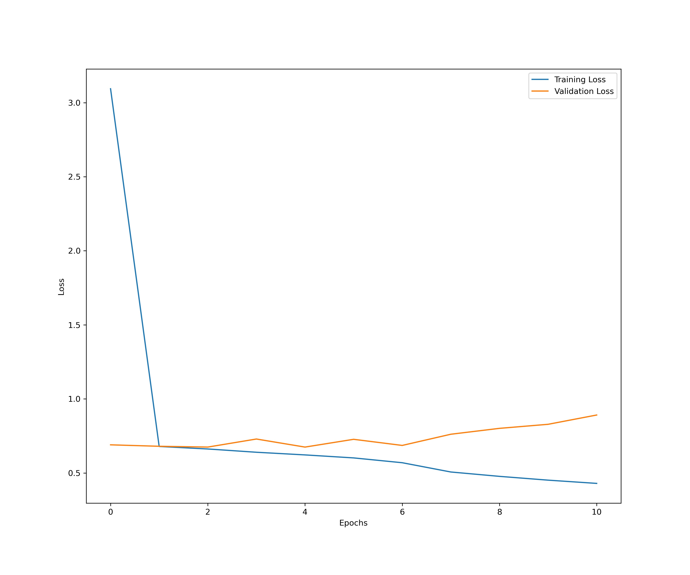
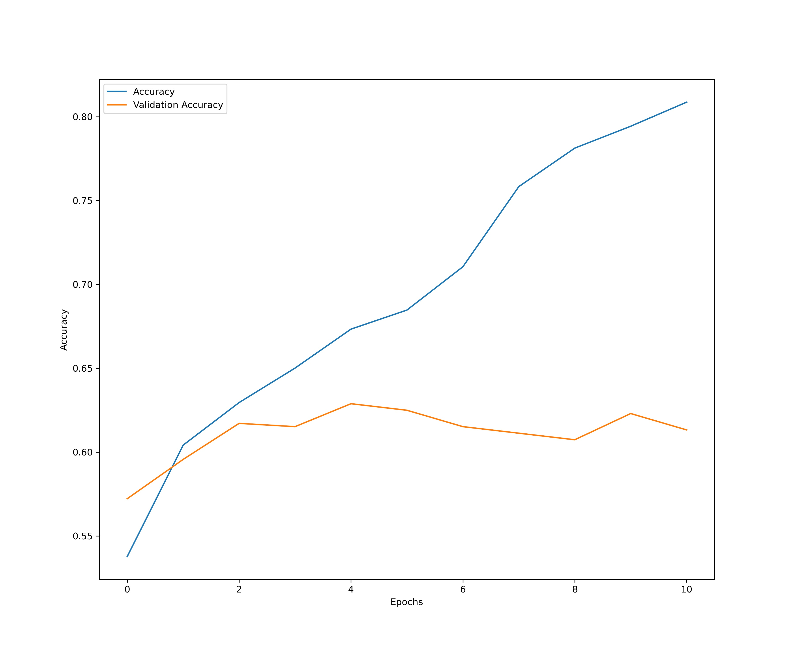
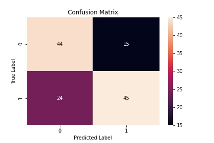
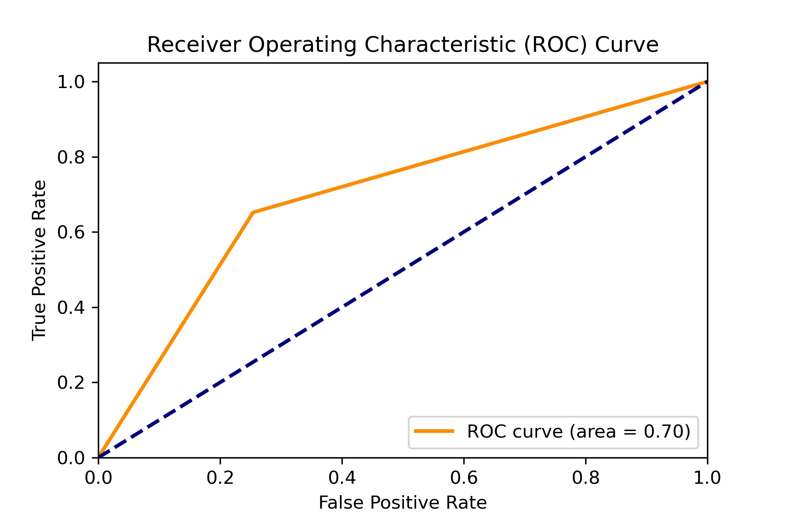
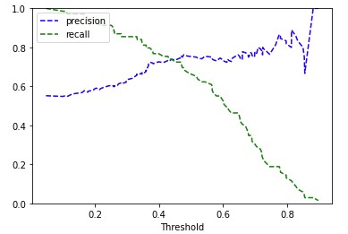
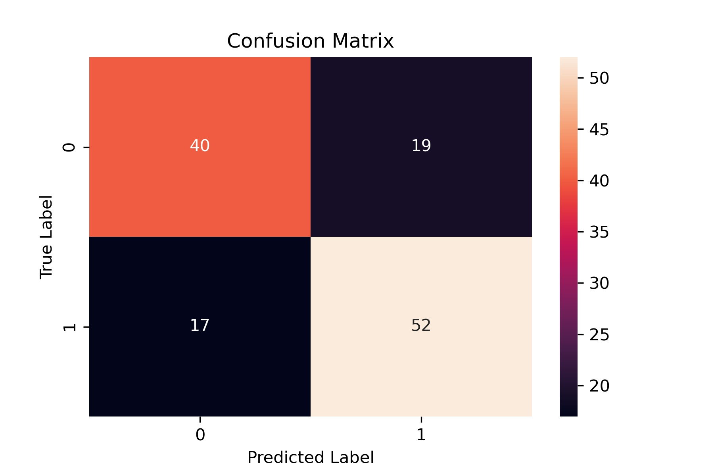
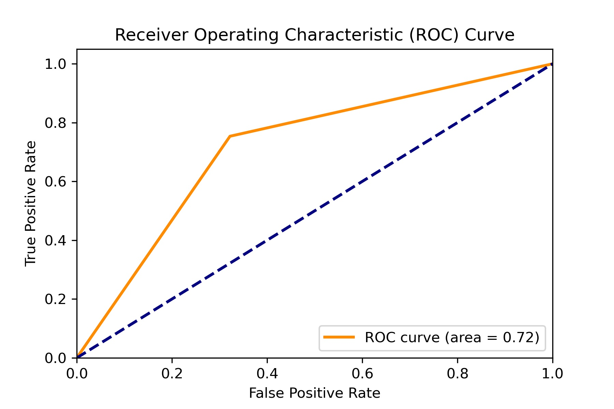

# FDA Submission

**Your Name:**  
David Arnone

**Name of your Device:**  
Udacity Environment

---

## **Title: Project: Pneumonia Detection from Chest X-Rays** 

---

The goal of this project was to develop a classification algorithm to assist practitioners in distinguishing pneumonia from other diseases and healthy states in patients. The data were extracted from the National Institutes of Health Chest X-Ray Database [NIH Chest X-Ray Dataset](https://www.kaggle.com/datasets/nih-chest-xrays/data).

We categorized the 2D X-rays into two groups:

1. Patients with pneumonia (PNEUMONIA).
2. Patients without pneumonia, which includes both healthy individuals and those with other diseases (NO_PNEUMONIA).

Due to the imbalance in overall pneumonia cases, we implemented two strategies:

1. **Geometric-based Image Augmentation:** This technique was used to address dataset imbalance, resulting in a more balanced distribution.
2. **Model Weighting:** We weighted the model according to the proportion of the augmented dataset.

We also balanced the data by gender, age, and other criteria to ensure the algorithm produced representative results. While the overall results provide some recommendations, the algorithm cannot be used as an automatic procedure for patient routing.

Further enhancements to the model, improved data balancing, and better augmentation methods need to be investigated. Thorough testing on more data could potentially yield an algorithm capable of nearly automating patient routing.

---

## Algorithm Description

### 1. General Information

**Intended Use Statement:**  
The developed algorithm is intended for use with individuals aged 20 to 60, of any gender. It should only be utilized by practitioners as an aid in validating diagnoses. The algorithm should not be relied upon as a standalone tool, particularly in cases involving high-risk patients, as it is not perfect and may not accurately identify all positive instances.

**Indications for Use:**

- Ages 20 to 60
- Any gender
- No high-risk patients
- Recall of 0.75, meaning our validation data indicates that 25% of pneumonia cases were not correctly identified.

**Device Limitations:**

*This section appears to be missing specific details. Please provide the limitations.*

**Clinical Impact of Performance:**

*This section appears to be missing specific details. Please provide the clinical impact.*

### 2. Algorithm Design and Function

**DICOM Checking Steps:**

*This section appears to be missing specific details. Please provide the DICOM checking steps.*

**Preprocessing Steps:**

- Augmentation using ImageDataGenerator from the tensorflow.keras.preprocessing.image library with the following parameters:
  - horizontal_flip = True
  - vertical_flip = False
  - height_shift_range = 0.05
  - width_shift_range = 0.05
  - zoom_range = 0.1
  - rotation_range = 7

**CNN Architecture:**

We used a customized version of the VGG16 model from the tensorflow.keras.applications library:

```
Model: "model"
_________________________________________________________________
Layer (type)                 Output Shape              Param #   
=================================================================
input_1 (InputLayer)         [(None, 224, 224, 3)]     0         
block1_conv1 (Conv2D)        (None, 224, 224, 64)      1792      
block1_conv2 (Conv2D)        (None, 224, 224, 64)      36928     
block1_pool (MaxPooling2D)   (None, 112, 112, 64)      0         
block2_conv1 (Conv2D)        (None, 112, 112, 128)     73856     
block2_conv2 (Conv2D)        (None, 112, 112, 128)     147584    
block2_pool (MaxPooling2D)   (None, 56, 56, 128)       0         
block3_conv1 (Conv2D)        (None, 56, 56, 256)       295168    
block3_conv2 (Conv2D)        (None, 56, 56, 256)       590080    
block3_conv3 (Conv2D)        (None, 56, 56, 256)       590080    
block3_pool (MaxPooling2D)   (None, 28, 28, 256)       0         
block4_conv1 (Conv2D)        (None, 28, 28, 512)       1180160   
block4_conv2 (Conv2D)        (None, 28, 28, 512)       2359808   
block4_conv3 (Conv2D)        (None, 28, 28, 512)       2359808   
block4_pool (MaxPooling2D)   (None, 14, 14, 512)       0         
block5_conv1 (Conv2D)        (None, 14, 14, 512)       2359808   
block5_conv2 (Conv2D)        (None, 14, 14, 512)       2359808   
block5_conv3 (Conv2D)        (None, 14, 14, 512)       2359808   
block5_pool (MaxPooling2D)   (None, 7, 7, 512)         0         
dropout (Dropout)            (None, 7, 7, 512)         0         
flattenCustom (Flatten)      (None, 25088)             0         
fc1 (Dense)                  (None, 512)               12845568  
fc3 (Dense)                  (None, 2)                 1026      
=================================================================
Total params: 27,561,282
Trainable params: 15,206,402
Non-trainable params: 12,354,880
_________________________________________________________________
```

### 3. Algorithm Training

**Parameters:**

- **Types of augmentation used during training:**
  - ImageDataGenerator with parameters:
    - horizontal_flip = True  
    - vertical_flip = False
    - height_shift_range = 0.05
    - width_shift_range = 0.05  
    - zoom_range = 0.1  
    - rotation_range = 7

- **Batch size:** 128
- **Optimizer learning rate:** Adam optimizer with learning_rate = 0.001

**Layers of pre-existing architecture that were frozen:**

```
Layer (type)                 Output Shape              Param #   
=================================================================
input_2 (InputLayer)         [(None, 224, 224, 3)]     0         
block1_conv1 (Conv2D)        (None, 224, 224, 64)      1792      
block1_conv2 (Conv2D)        (None, 224, 224, 64)      36928     
block1_pool (MaxPooling2D)   (None, 112, 112, 64)      0         
block2_conv1 (Conv2D)        (None, 112, 112, 128)     73856     
block2_conv2 (Conv2D)        (None, 112, 112, 128)     147584    
block2_pool (MaxPooling2D)   (None, 56, 56, 128)       0         
block3_conv1 (Conv2D)        (None, 56, 56, 256)       295168    
block3_conv2 (Conv2D)        (None, 56, 56, 256)       590080    
block3_conv3 (Conv2D)        (None, 56, 56, 256)       590080    
block3_pool (MaxPooling2D)   (None, 28, 28, 256)       0         
block4_conv1 (Conv2D)        (None, 28, 28, 512)       1180160   
block4_conv2 (Conv2D)        (None, 28, 28, 512)       2359808   
block4_conv3 (Conv2D)        (None, 28, 28, 512)       2359808   
block4_pool (MaxPooling2D)   (None, 14, 14, 512)       0         
block5_conv1 (Conv2D)        (None, 14, 14, 512)       2359808   
block5_conv2 (Conv2D)        (None, 14, 14, 512)       2359808   
block5_conv3 (Conv2D)        (None, 14, 14, 512)       2359808
```

**Layers of pre-existing architecture that were fine-tuned:**

```
block5_conv3 (Conv2D)        (None, 14, 14, 512)       2359808   
block5_pool (MaxPooling2D)   (None, 7, 7, 512)         0         
```

**Layers added to pre-existing architecture:**

```
flattenCustom (Flatten)      (None, 25088)             0         
dropout_1 (Dropout)          (None, 25088)             0         
fc1 (Dense)                  (None, 512)               12845568  
fc2 (Dense)                  (None, 2)                 1026
```








**Final Threshold and Explanation:**

As we wan't to avoid predicting false negative, we have have computed a threshold to improve this metrics without decreasing to much the precision which is less important in our use case.


After ajusting the threshold we got the following confusion matrix:



and adjuested ROC Curve


### 4. Databases

**Description of Training Dataset:**

| Category                     | Number of Cases |
|------------------------------|-----------------|
| Healthy cases                | 43328           |
| Disease cases                | 35376           |
|   Not pneumonia cases        | 34389           |
|   Pneumonia cases            | 987             |
|     - Pure cases             | 224             |
|     - With other diseases    | 763             |
| Total cases                  | 78704           |

Due to the limited number of pneumonia cases, we augmented them by a factor of three and selected a similar number of non-pneumonia cases split between healthy and disease cases. The training set consisted of 4776 images split into two categories, with a validation set of 356 images.

**Description of Validation Dataset:**

The validation data consisted of 20% of the preselected data, with non-pneumonia cases reduced to match the number of pneumonia cases for a balanced augmented dataset.

### 5. Ground Truth

Ground truth was defined by radiologist experts and provided as labels on the images, which were used to customize our algorithm for pneumonia detection.

### 6. FDA Validation Plan

**Patient Population Description for FDA Validation Dataset:**

The subset of data used to train the model was balanced for age (20-60 years), gender, and image types (AP and PA). Outlier image formats were excluded.

**Ground Truth Acquisition Methodology:**

Ground truth was provided by NIH. More information can be found at [NIH Chest X-Ray Dataset](https://www.kaggle.com/datasets/nih-chest-xrays/data).

**Future Version:**

The next version aims to enhance recall and precision to above 90%. To achieve this, we will:

- Improve data preprocessing.
- Augment pneumonia data with better augmentation algorithms.
- Select more data corresponding to the augmentation.

More GPU power will be required, but currently, we do not have access to sufficient GPU resources.

---