**David Arnone**

**Future Healthcare AI Engineer**

**Udacity**

18/12/2023

---

## **Automated Segmentation of Hippocampal Area in Brain MRI using UNet CNN from networks.Recursive** 

## *Abstract*:

The goal of this project was the development of a segmentation algorithm based on the CNN UNet to identify th e Hippocampal area.
The images extracted from the kagle project alllowed us to train the CNN on 80% of the  260 3D images of part of the brain volume which gives us 9198 slice or 2D images after a carefull EDA phase.
10 % of the data were tested for validation and another 10 % of data were tested. Using the Dice and Jaccard coefficient , we  have obtained 82 % for Dice and 98 % for Jaccard mean coefficient using standard CrossEntropy loss function for training on only 10  epochs.

Another objective was to showcase the possibility of incorporating the segmentation algorithm into a prototype software component capable of scanning directories, selecting relevant DICOM files, applying our model, generating a final DICOM report with visualization of the predicted results, and ultimately sending it to a DICOM server.
Ultimately, the goal is to generalize and integrate the software into a server with the ability to scan directories, detect new DICOM files, apply a suitable algorithm (which could be specific to different parts of the body or based on specific tags) using metadata extracted from the DICOM format, generate a customized report for the practitioner, and automatically store it within a DICOM server.

---
## *Introduction*
Alzheimer's disease (AD) is a progressive neurodegenerative disorder that results in impaired neuronal (brain cell) function and eventually, cell death. AD is the most common cause of dementia. Clinically, it is characterized by memory loss, inability to learn new material, loss of language function, and other manifestations.

For patients exhibiting early symptoms, quantifying disease progression over time can help direct therapy and disease management.
We are delivering an AI-based algorithm capable of detecting the Hippocampus through a segmentation algorithm within a specific 3D section of the brain. This aims to facilitate the subsequent volume assessment of the Hippocampus, forming a foundational component for the eventual quantification of Hippocampus Volume for tracking Alzheimer's progression. Additionally, our goal is to offer a proof of concept demonstrating the integration of this algorithm into a PAC system using the DICOM format.

---
## *Methodology*
Bellow is the model description we  will  be using within the package **networks.RecursiveUNet** adapted for segmentation tasks :

    UNet(
        (model): UnetSkipConnectionBlock(
            (model): Sequential(
               (0): Sequential(
                    (0): Conv2d(1, 64, kernel_size=(3, 3), stride=(1, 1), padding=(1, 1))
                    (1): InstanceNorm2d(64, eps=1e-05, momentum=0.1, affine=False, track_running_stats=False)
                    (2): LeakyReLU(negative_slope=0.01, inplace=True)
                )
                (1): Sequential(
                    (0): Conv2d(64, 64, kernel_size=(3, 3), stride=(1, 1), padding=(1, 1))
                    (1): InstanceNorm2d(64, eps=1e-05, momentum=0.1, affine=False, track_running_stats=False)
                    (2): LeakyReLU(negative_slope=0.01, inplace=True)
                )
                (2): UnetSkipConnectionBlock(
                    (model): Sequential(
                        (0): MaxPool2d(kernel_size=2, stride=2, padding=0, dilation=1, ceil_mode=False)
                        (1): Sequential(
                            (0): Conv2d(64, 128, kernel_size=(3, 3), stride=(1, 1), padding=(1, 1))
                            (1): InstanceNorm2d(128, eps=1e-05, momentum=0.1, affine=False, track_running_stats=False)
                            (2): LeakyReLU(negative_slope=0.01, inplace=True)
                        )
                        (2): Sequential(
                            (0): Conv2d(128, 128, kernel_size=(3, 3), stride=(1, 1), padding=(1, 1))
                            (1): InstanceNorm2d(128, eps=1e-05, momentum=0.1, affine=False, track_running_stats=False)
                            (2): LeakyReLU(negative_slope=0.01, inplace=True)
                        )
                        (3): UnetSkipConnectionBlock(
                            (model): Sequential(
                                (0): MaxPool2d(kernel_size=2, stride=2, padding=0, dilation=1, ceil_mode=False)
                                (1): Sequential(
                                    (0): Conv2d(128, 256, kernel_size=(3, 3), stride=(1, 1), padding=(1, 1))
                                    (1): InstanceNorm2d(256, eps=1e-05, momentum=0.1, affine=False, track_running_stats=False)
                                    (2): LeakyReLU(negative_slope=0.01, inplace=True)
                                )
                                (2): Sequential(
                                    (0): Conv2d(256, 256, kernel_size=(3, 3), stride=(1, 1), padding=(1, 1))
                                    (1): InstanceNorm2d(256, eps=1e-05, momentum=0.1, affine=False, track_running_stats=False)
                                    (2): LeakyReLU(negative_slope=0.01, inplace=True)
                                )
                                (3): UnetSkipConnectionBlock(
                                    (model): Sequential(
                                        (0): MaxPool2d(kernel_size=2, stride=2, padding=0, dilation=1, ceil_mode=False)
                                        (1): Sequential(
                                            (0): Conv2d(256, 512, kernel_size=(3, 3), stride=(1, 1), padding=(1, 1))
                                            (1): InstanceNorm2d(512, eps=1e-05, momentum=0.1, affine=False, track_running_stats=False)
                                            (2): LeakyReLU(negative_slope=0.01, inplace=True)
                                        )
                                        (2): Sequential(
                                            (0): Conv2d(512, 512, kernel_size=(3, 3), stride=(1, 1), padding=(1, 1))
                                            (1): InstanceNorm2d(512, eps=1e-05, momentum=0.1, affine=False, track_running_stats=False)
                                            (2): LeakyReLU(negative_slope=0.01, inplace=True)
                                        )
                                        (3): UnetSkipConnectionBlock(
                                            (model): Sequential(
                                                (0): MaxPool2d(kernel_size=2, stride=2, padding=0, dilation=1, ceil_mode=False)
                                                (1): Sequential(
                                                    (0): Conv2d(512, 1024, kernel_size=(3, 3), stride=(1, 1), padding=(1, 1))
                                                    (1): InstanceNorm2d(1024, eps=1e-05, momentum=0.1, affine=False, track_running_stats=False)
                                                    (2): LeakyReLU(negative_slope=0.01, inplace=True)
                                                )
                                                (2): Sequential(
                                                    (0): Conv2d(1024, 1024, kernel_size=(3, 3), stride=(1, 1), padding=(1, 1))
                                                    (1): InstanceNorm2d(1024, eps=1e-05, momentum=0.1, affine=False, track_running_stats=False)
                                                    (2): LeakyReLU(negative_slope=0.01, inplace=True)
                                                )
                                                (3): ConvTranspose2d(1024, 512, kernel_size=(2, 2), stride=(2, 2))
                                            )
                                        )
                                        (4): Sequential(
                                            (0): Conv2d(1024, 512, kernel_size=(3, 3), stride=(1, 1), padding=(1, 1))
                                            (1): LeakyReLU(negative_slope=0.01, inplace=True)
                                        )
                                        (5): Sequential(
                                            (0): Conv2d(512, 512, kernel_size=(3, 3), stride=(1, 1), padding=(1, 1))
                                            (1): LeakyReLU(negative_slope=0.01, inplace=True)
                                        )
                                        (6): ConvTranspose2d(512, 256, kernel_size=(2, 2), stride=(2, 2))
                                    )
                                )
                                (4): Sequential(
                                    (0): Conv2d(512, 256, kernel_size=(3, 3), stride=(1, 1), padding=(1, 1))
                                    (1): LeakyReLU(negative_slope=0.01, inplace=True)
                                )
                                (5): Sequential(
                                    (0): Conv2d(256, 256, kernel_size=(3, 3), stride=(1, 1), padding=(1, 1))
                                    (1): LeakyReLU(negative_slope=0.01, inplace=True)
                                )
                                (6): ConvTranspose2d(256, 128, kernel_size=(2, 2), stride=(2, 2))
                            )
                        )
                        (4): Sequential(
                            (0): Conv2d(256, 128, kernel_size=(3, 3), stride=(1, 1), padding=(1, 1))
                            (1): LeakyReLU(negative_slope=0.01, inplace=True)
                        ) 
                        (5): Sequential(
                            (0): Conv2d(128, 128, kernel_size=(3, 3), stride=(1, 1), padding=(1, 1))
                            (1): LeakyReLU(negative_slope=0.01, inplace=True)
                        )
                        (6): ConvTranspose2d(128, 64, kernel_size=(2, 2), stride=(2, 2))
                    )
                )
                (3): Sequential(
                    (0): Conv2d(128, 64, kernel_size=(3, 3), stride=(1, 1), padding=(1, 1))
                    (1): LeakyReLU(negative_slope=0.01, inplace=True)
                )
                (4): Sequential(
                    (0): Conv2d(64, 64, kernel_size=(3, 3), stride=(1, 1), padding=(1, 1))
                    (1): LeakyReLU(negative_slope=0.01, inplace=True)
                )
                (5): Conv2d(64, 3, kernel_size=(1, 1), stride=(1, 1))
            )
        )
    )

Please , refer to the section data  see  the dataset used: we have done training on batch of 64 slices each for 10 epochs wqith a CrossEntropy loss function an a 0.0002 learning rate.
A localized volume of the original brain T2 MRI scans has been cropped to easier the training phase due to the infrastructure but we have to bear in mind that this selection should be made careffully in order to our algorithm to work and relaase accurate results.             
                  
---
## *Data*
We are using the "Hippocampus" dataset from the Medical Decathlon competition. This dataset is stored as a collection of NIFTI files, with one file per volume, and one file per corresponding segmentation mask.
The original images here are T2 MRI scans of the full brain. As noted, in this dataset we are using **cropped volumes** where only the region around the hippocampus has been cut out. 
After an EDA phase, we have finaly e  260 3D images representing 9198 slices.
80 % of the data were allocated for training , 10 % for validation and the remaining 10 % for test 
Unfortunatley we're missing information on the origin of data like gender and age in order to specify more precisely the valididity of the Algorythm.

---

## *Results*

**Model**

We have choose to run the training phase for 10 epochs.

Bellow you can see the loss function done on 10 epochs on batch of 64 slices (**Note:  there is a factor 100, 1000 corespond to epoch 10**) :
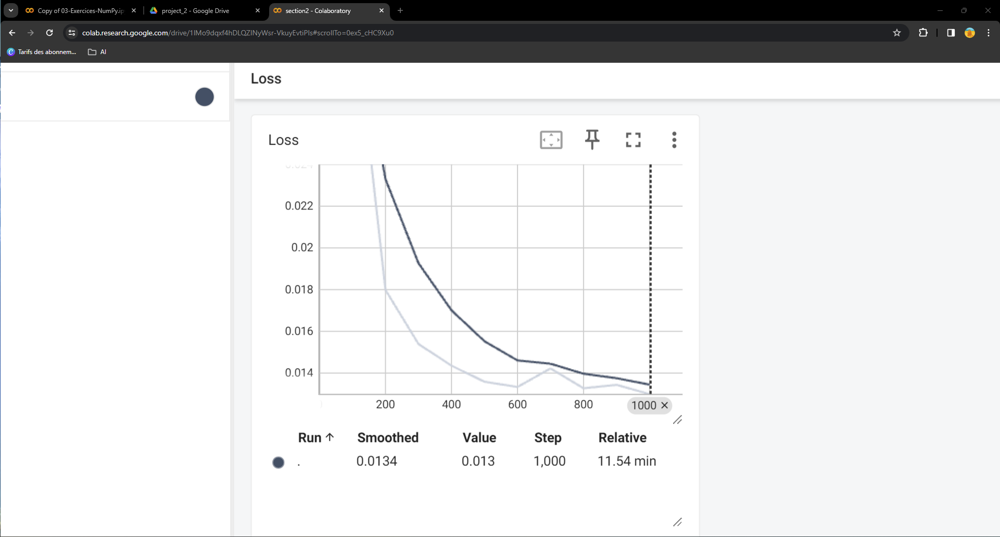

The learning rate is :  0.0002
The loss function used is : CrossEntropy from torch.nn package

With tensorboard we have logged results of the model compared to the reference .

for each 10 th batch we logged the 16 images of the batch with the their prediction and original segmentation mask. Bellow are some of the results at some iteation: 

*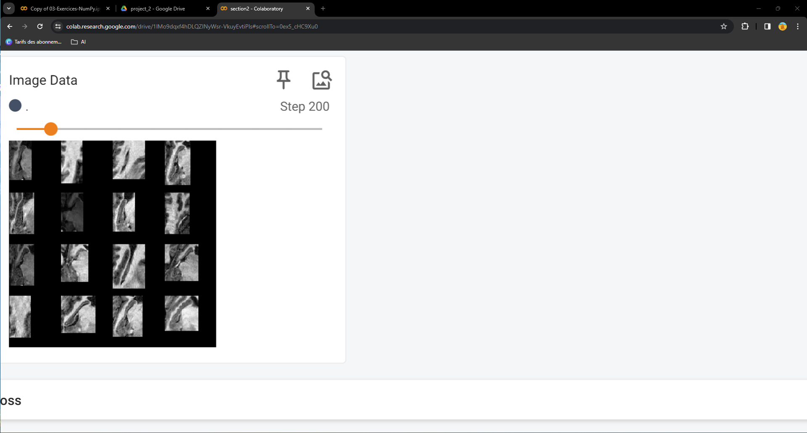*

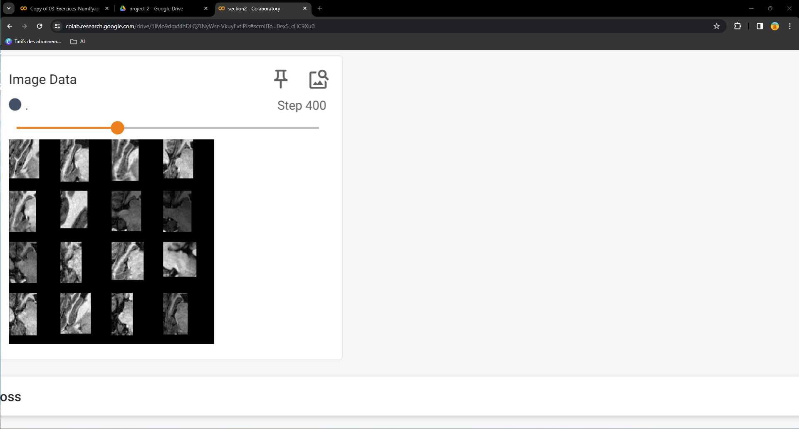
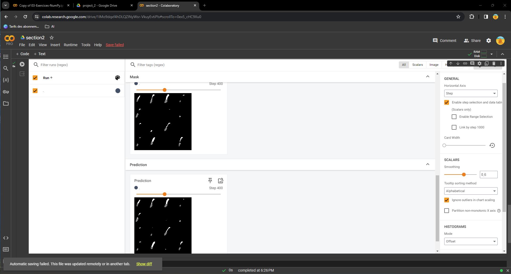

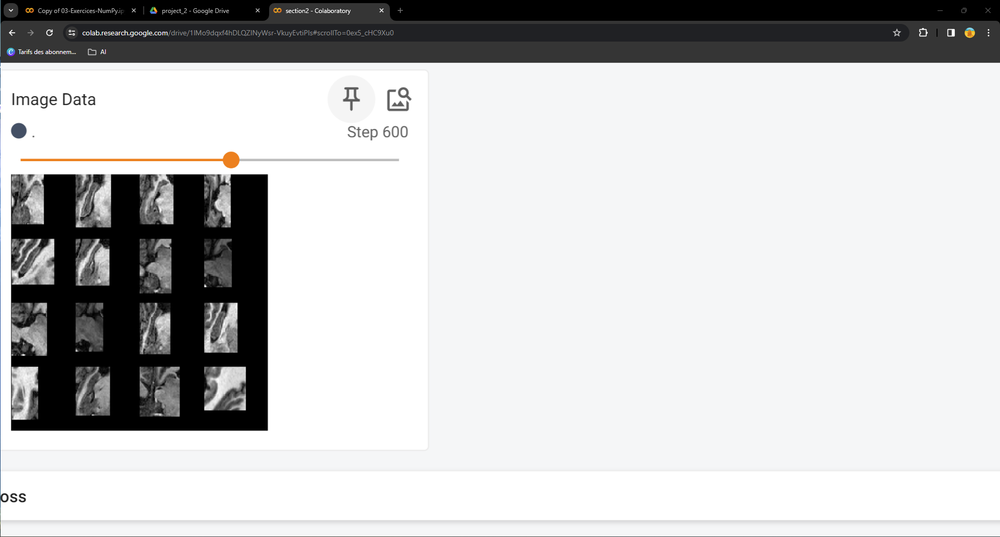

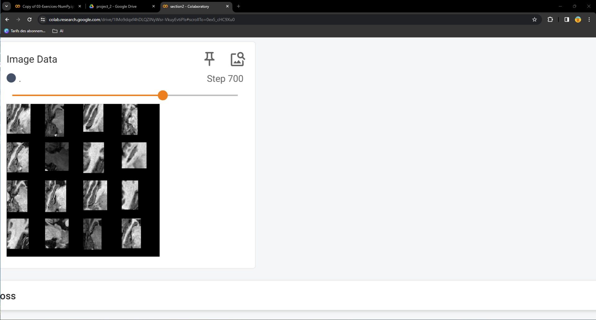
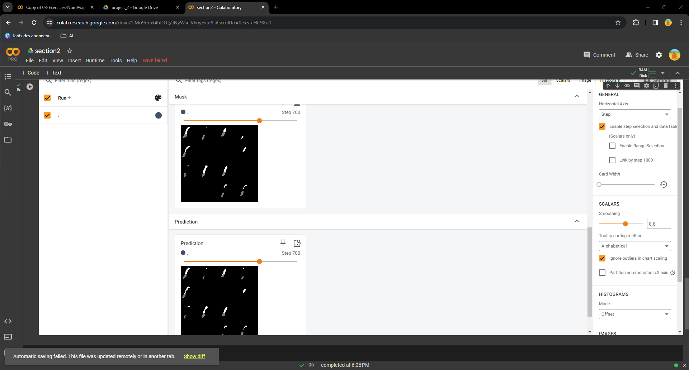

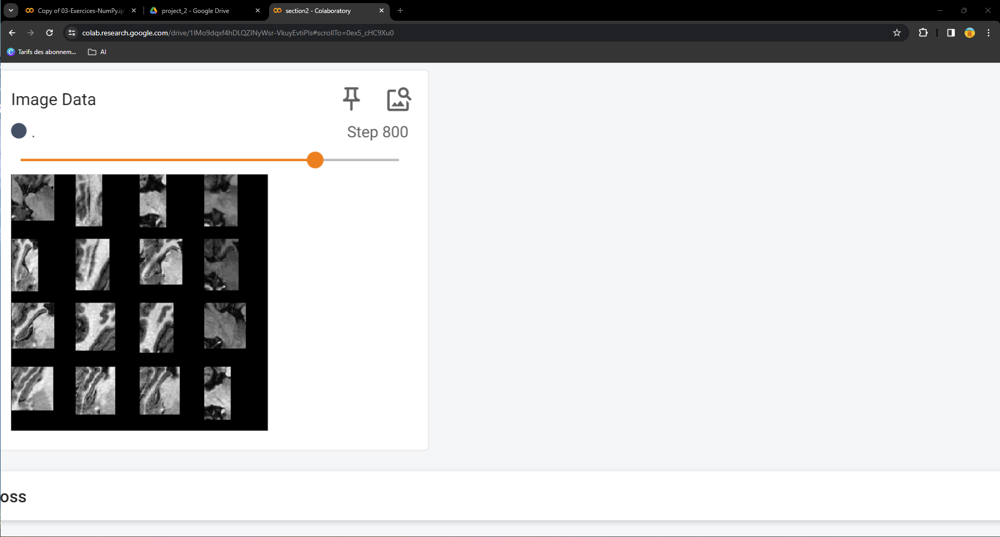

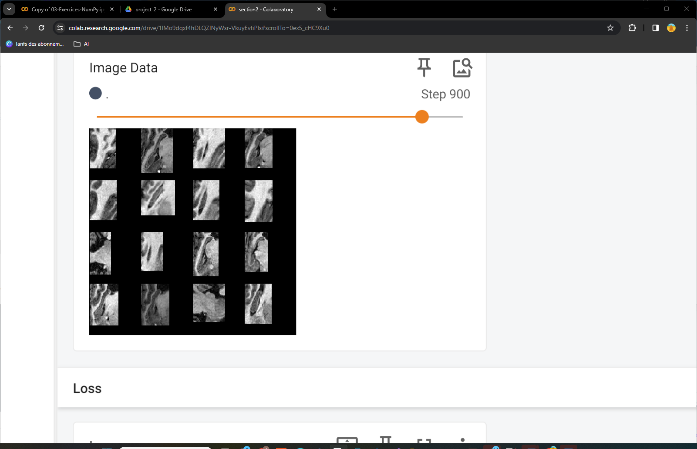
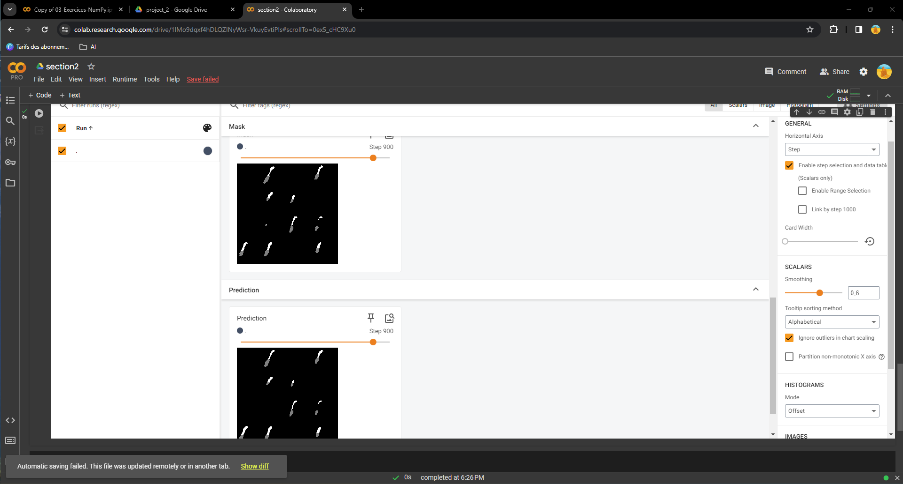

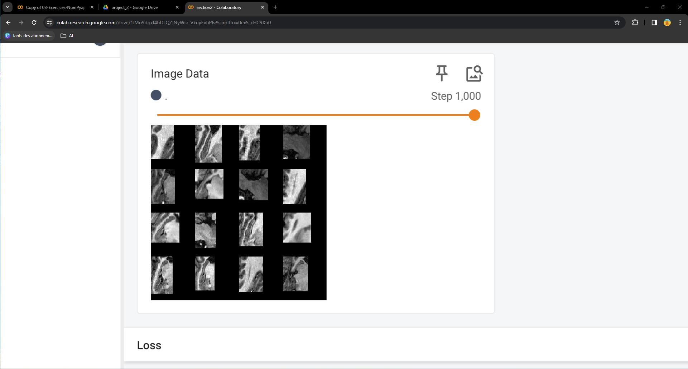
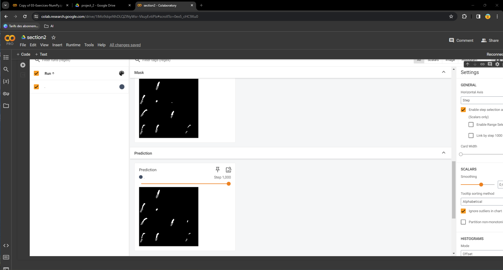

we did compute dice and jaccard coefficient on test data not involved in the training and obtained the following result for the tested data

    {
    "volume_stats": [
    {
      "filename": "hippocampus_304.nii.gz",
      "dice": 0.8269253802850641,
      "jaccard": 0.9805911310199394
    },
    {
      "filename": "hippocampus_098.nii.gz",
      "dice": 0.863560982963968,
      "jaccard": 0.9881277999698276
    },
    {
      "filename": "hippocampus_180.nii.gz",
      "dice": 0.7938635686624963,
      "jaccard": 0.9819009258774912
    },
    {
      "filename": "hippocampus_001.nii.gz",
      "dice": 0.8175977653631284,
      "jaccard": 0.9819446172563007
    },
    {
      "filename": "hippocampus_205.nii.gz",
      "dice": 0.8286516853932584,
      "jaccard": 0.9833850344253613
    },
    {
      "filename": "hippocampus_083.nii.gz",
      "dice": 0.8683422320614663,
      "jaccard": 0.9851518956667328
    },
    {
      "filename": "hippocampus_038.nii.gz",
      "dice": 0.8319862845946608,
      "jaccard": 0.9820564463393581
    },
    {
      "filename": "hippocampus_328.nii.gz",
      "dice": 0.8570181183147785,
      "jaccard": 0.9833076364377732
    },
    {
      "filename": "hippocampus_393.nii.gz",
      "dice": 0.8461628588166373,
      "jaccard": 0.9823484731362044
    },
    {
      "filename": "hippocampus_164.nii.gz",
      "dice": 0.8219770711659096,
      "jaccard": 0.9805875623592126
    },
    {
      "filename": "hippocampus_049.nii.gz",
      "dice": 0.8406979379107183,
      "jaccard": 0.980575549507481
    },
    {
      "filename": "hippocampus_145.nii.gz",
      "dice": 0.8214577259475219,
      "jaccard": 0.9794478712907838
    },
    {
      "filename": "hippocampus_006.nii.gz",
      "dice": 0.8663376516553568,
      "jaccard": 0.9820268215125121
    },
    {
      "filename": "hippocampus_245.nii.gz",
      "dice": 0.7788232342240622,
      "jaccard": 0.9757033688664098
    },
    {
      "filename": "hippocampus_383.nii.gz",
      "dice": 0.8242025809593377,
      "jaccard": 0.9788598366175738
    },
    {
      "filename": "hippocampus_052.nii.gz",
      "dice": 0.8368652037617554,
      "jaccard": 0.9814889908583218
    },
    {
      "filename": "hippocampus_268.nii.gz",
      "dice": 0.7938348043736003,
      "jaccard": 0.9777744640663499
    },
    {
      "filename": "hippocampus_249.nii.gz",
      "dice": 0.8604681236260183,
      "jaccard": 0.9836701954582259
    },
    {
      "filename": "hippocampus_244.nii.gz",
      "dice": 0.7834946510443199,
      "jaccard": 0.9783918448280245
    },
    {
      "filename": "hippocampus_194.nii.gz",
      "dice": 0.8324576765907764,
      "jaccard": 0.9841116062778531
    },
    {
      "filename": "hippocampus_222.nii.gz",
      "dice": 0.7441130298273155,
      "jaccard": 0.9745776530055226
    },
    {
      "filename": "hippocampus_152.nii.gz",
      "dice": 0.8676889375684557,
      "jaccard": 0.9837485874186084
    },
    {
      "filename": "hippocampus_290.nii.gz",
      "dice": 0.8053691275167785,
      "jaccard": 0.9791810475743435
    },
    {
      "filename": "hippocampus_331.nii.gz",
      "dice": 0.8171931641636457,
      "jaccard": 0.9804934655872682
    },
    {
      "filename": "hippocampus_023.nii.gz",
      "dice": 0.810904071773637,
      "jaccard": 0.9773247634548012
    },
    {
      "filename": "hippocampus_130.nii.gz",
      "dice": 0.8264252008672364,
      "jaccard": 0.9811913958582376
    }
  ],
  "overall": {
    "mean_dice": 0.8256315026704579,
    "mean_jaccard": 0.9810757301796352
  },
  "config": {
    "name": "Basic_unet",
    "pwd": "/home/workspace/home/data",
    "root_dir": "/home/workspace/home/data",
    "n_epochs": 10,
    "learning_rate": 0.0002,
    "batch_size": 64,
    "patch_size": 64,
    "test_results_dir": "RESULTS",
    "train_ratio": 0.8,
    "val_ratio": 0.1,
    "test_ratio": 0.09999999999999995
  }
  }   

So the average Dice coefficient is : **83 %** and the Jaccard is even better : **98%** , which seems to be a decent result considering the few epochs for the training and the good mapping coefficient we have obtained. 

**Integration**

We have successfully demonstrated the application of our segmentation model to a set of DICOM files. This involved detecting the modality (MR) and the series description 'HippoCrop,' allowing us to send a formatted report that includes the presentation of three images from the series.

The outcome of one of the series is displayed below, featuring the images and their corresponding masks.

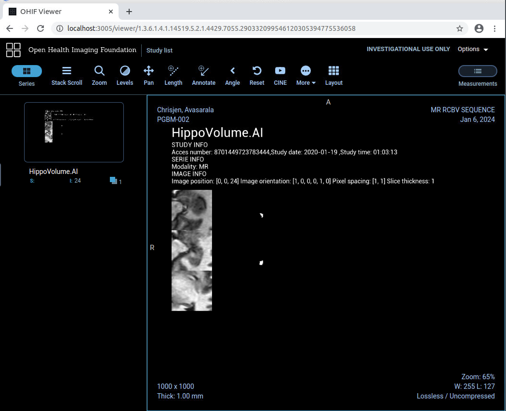

---
## *Discussion*

**Model**

Compare your results with existing literature and discuss the significance of your contributions.
Dice and Jaccard coefficients results beeing particulary adapted in validating the efficiency of segmentation Algorithm, the relatively high coefficients we found on test data are a good validation of our Algorithm. 

Improvement could be made on training by using other loss function like cusomized on based on Dice or Jaccard coefficient but also by using other learning rates and optimizing founction.

Training on real full brain MRI images , should be done to market the Algorithm but we need probably to train this stuff on more epochs ( >=100) and have the appropriate infrastructure to do it .

Another big area of improvement could be to use latest models and methods optimized for this problem like 
-DeepHipp model based on attention mechanism
-Using in conjonction of U-net GAN's to augment accuracy 

**Integration**

To transition to production, we need to enhance our proof of concept solution by implementing the following:

1. *Configure a Robust Server:*
   Establish a dedicated server configured to continuously scan a predefined set of repositories.

2. *Implement Dynamic Model Selection:*
   Develop a mechanism within the server to externally describe criteria that trigger the application of specific models. This should be based on information retrieved from DICOM files and possibly other external information providers.

3. *Utilize Criteria for Report Storage:*
   Leverage the defined criteria to determine the storage location of the final reports. This could involve storing reports in different Picture Archiving and Communication Systems (PACS) based on specific criteria.

By addressing these aspects, we aim to create a more robust dynamic and flexible system that can efficiently scan, process, and store medical imaging data based on configurable criteria.

Iteally, the final dicom reports should include more information from the dicom it self like gender, body part analysed and not just the header part.

 ---	

In general we should have an configurable way of describing which algorytm to apply 

---
## *Conclusion*
Our Hippocampus  algorithm within the boundaries( carefully preselected area of the MRI images)  give very good result with few training using appropriate coefficient.
## *Acknowledgments*
Acknowledge to Udacity for having setup the environment and framework.
## *Contact Information:*
David Arnone, Zürich , arnoneda@outlook.com.
